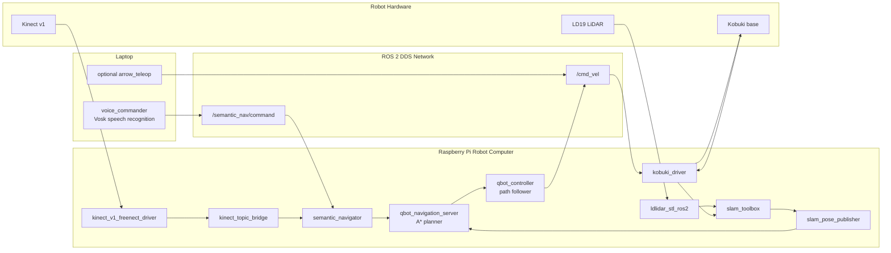
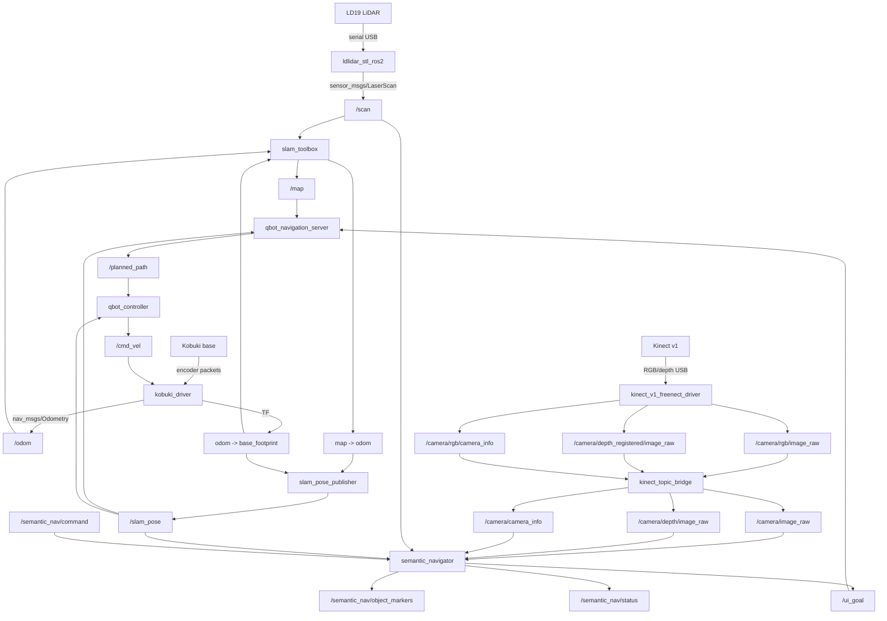
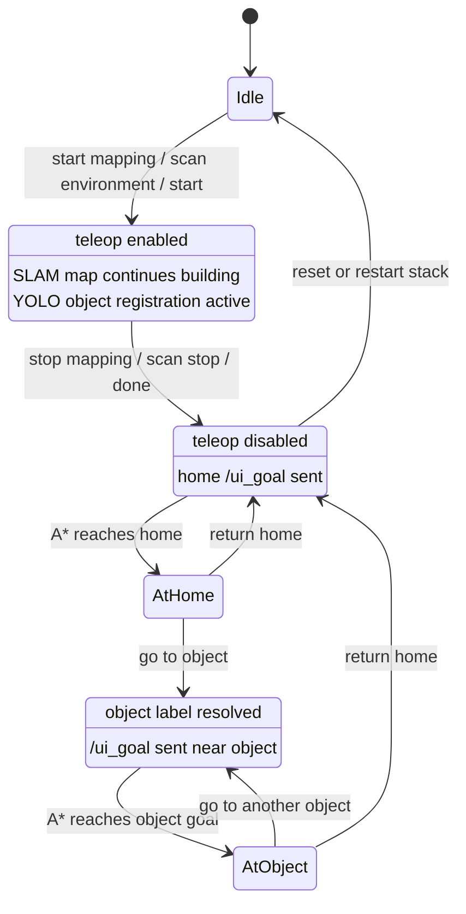
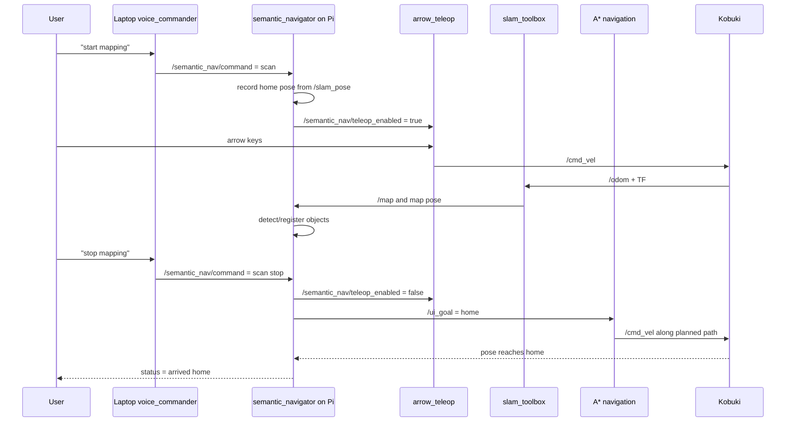
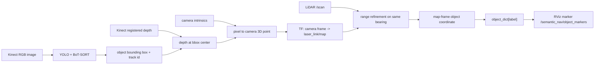
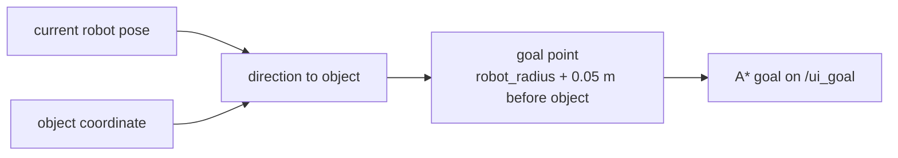
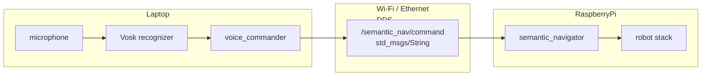

# Technical System Explanation

This document explains the architecture of the Kobuki LiDAR + Kinect semantic navigation system. It is intended for presentations, reports, and future maintainers.

## 1. Goal

The system turns a real Kobuki base into a semantic navigation robot:

1. Build a 2D map using LiDAR.
2. Detect objects using Kinect RGB images and YOLO.
3. Estimate object positions using Kinect depth and LiDAR range correction.
4. Pin objects in the SLAM map.
5. Navigate home or to saved objects.
6. Accept voice commands from a laptop over ROS 2 DDS.

## 2. Main Runtime Placement



The laptop does not need direct access to robot hardware. It only publishes recognized text commands on `/semantic_nav/command`.

## 3. Topic-Level Architecture



## 4. Command State Machine



## 5. Mapping And Return-Home Sequence



## 6. Object Mapping Pipeline



Object labels are stored as:

```text
class_trackid
```

Examples:

```text
chair_13
bottle_4
person_2
```

The voice command does not need to say the underscore. These are equivalent:

```text
go to chair thirteen
go to chair one three
go to chair 13
```

## 7. Object Navigation Clearance

The object coordinate is not used as the robot base goal directly. If the robot base drove to the object point, the body would collide with the object.

The system computes:

```text
base_goal_distance_from_object = robot_radius + object_clearance
```

Defaults:

```text
robot_radius = 0.20 m
object_clearance = 0.05 m
base goal = 0.25 m away from object
```

This means the front of the Kobuki stops about 5 cm from the object.



## 8. DDS Voice Distribution

ROS 2 uses DDS discovery and pub/sub communication. The laptop voice node and Pi robot nodes are separate processes on different machines but share the same ROS graph when:

- `ROS_DOMAIN_ID` is the same
- discovery is allowed across the network
- both machines can reach each other by UDP/multicast or static peer configuration



Recommended basic environment on both machines:

```bash
export ROS_DOMAIN_ID=42
export RMW_IMPLEMENTATION=rmw_fastrtps_cpp
export ROS_AUTOMATIC_DISCOVERY_RANGE=SUBNET
unset ROS_LOCALHOST_ONLY
```

If multicast is blocked, use static peers:

```bash
# Laptop
export ROS_STATIC_PEERS='PI_IP_ADDRESS'

# Pi
export ROS_STATIC_PEERS='LAPTOP_IP_ADDRESS'
```

## 9. Important Nodes

| Node | Machine | Purpose |
|---|---|---|
| `voice_commander` | Laptop | Converts speech to normalized text commands |
| `kobuki_driver` | Pi | Serial bridge between ROS `/cmd_vel` and Kobuki base |
| `ldlidar_stl_ros2_node` | Pi | Publishes `/scan` from LD19 LiDAR |
| `kinect_v1_freenect_driver` | Pi | Publishes Kinect RGB/depth streams |
| `kinect_topic_bridge` | Pi | Normalizes Kinect topics to `/camera/*` |
| `slam_toolbox` | Pi | Builds `/map` from `/scan` and `/odom` |
| `slam_pose_publisher` | Pi | Publishes `/slam_pose` from TF |
| `semantic_navigator` | Pi | Command state machine, object mapping, object goals |
| `qbot_navigation_server` | Pi | A* path planning on `/map` |
| `qbot_controller` | Pi | Path following, publishes `/cmd_vel` |

## 10. Failure Modes And Fixes

| Symptom | Likely Cause | Fix |
|---|---|---|
| No `/map` | `/scan` or `/odom` missing | Check LiDAR and Kobuki topics first |
| No `/scan` | LiDAR port wrong or permission issue | Check `/dev/serial/by-id`, udev, `dialout` |
| No `/odom` | Kobuki port wrong or base off | Check by-id device and Kobuki power |
| Kinect invalid index | Kinect busy or USB reset needed | Kill old Kinect process, unplug/replug Kinect |
| Object marker offset | Camera TF/depth issue | Verify Kinect frame, depth stream, and object is visible to LiDAR |
| Voice not seen on Pi | DDS discovery issue | Match `ROS_DOMAIN_ID`, unset `ROS_LOCALHOST_ONLY`, use static peers |
| `chair_13` not recognized | Spoken underscore/numbers | Say `chair thirteen` or `chair one three` |

## 11. Launch Summary

Pi:

```bash
ros2 launch diff_drive_robot lidar_semantic_hw.launch.py \
  use_voice:=false \
  start_kinect_driver:=true \
  use_kinect_topic_bridge:=true \
  use_semantic:=true \
  use_qbot_nav:=true \
  use_rviz:=false
```

Laptop:

```bash
ros2 run diff_drive_robot voice_commander
```

Manual command test from either machine:

```bash
ros2 topic pub --once /semantic_nav/command std_msgs/msg/String "{data: 'start mapping'}"
ros2 topic pub --once /semantic_nav/command std_msgs/msg/String "{data: 'stop mapping'}"
ros2 topic pub --once /semantic_nav/command std_msgs/msg/String "{data: 'go to chair thirteen'}"
```
